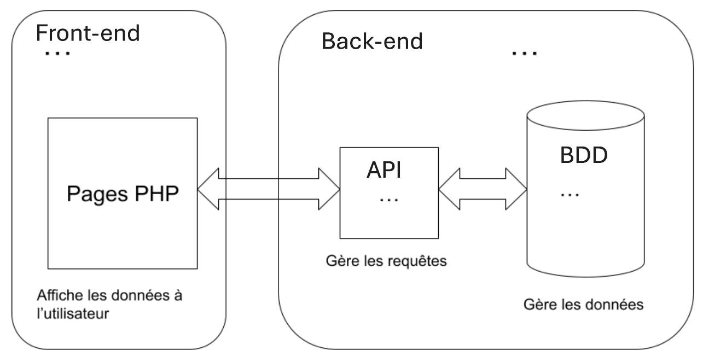

# **Projet : EatSmart**

**Etudiant :** ELSERMANS Alexandre

---

### **1. Description du projet**

Programmation d’un site web marchand proposant de la nourriture avec gestion des menus et gestion d’un affichage précisant quand la commande est prête. De plus, une option historique des commandes devrait être accessible.

---

### **3. Fonctionnalités principales**

#### **3.1 Frontend (eatSmartFront)**

- **Fonctionnalité 1 :**  
  Présentation d’un menu
  
- **Fonctionnalité 2 :**  
  Présentation d’un historique de commande
  
#### **3.2 Backend (eatSmartBack)**

- **Fonctionnalité 1 :**  
  Gestion du menu selon les saisons et des stocks
  
- **Fonctionnalité 2 :**  
  Précision de l’état de la préparation

---

### **4. Technologies utilisées**

- **Frontend :** HTML/CSS/JS/PHP
- **Backend :** PHP/API REST
- **Base de données :** PHPmyAdmin/API REST

---

## Documentation MCD/MLD/MPD :

---

---

